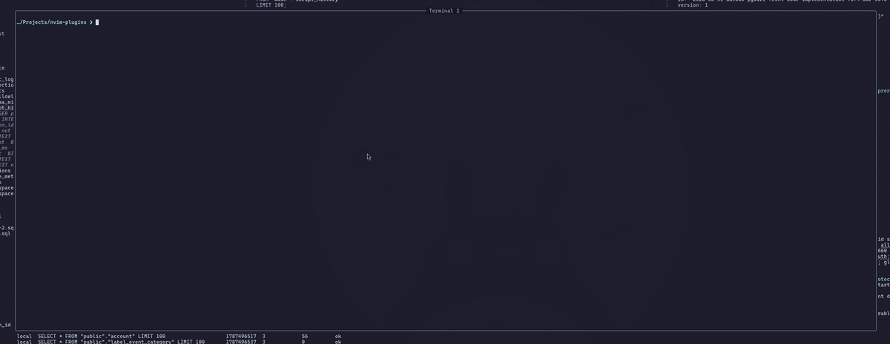
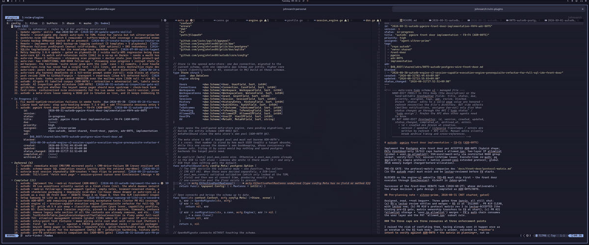
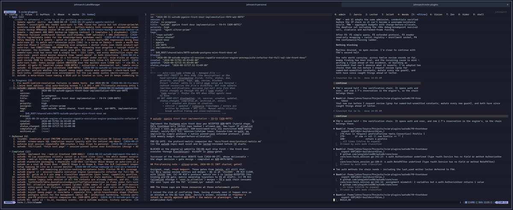

<h1 align="center">autodb</h1>

<p align="center">
  <strong>A security-first database IDE — for teams who cannot hand out production credentials.</strong>
</p>

<p align="center">
  One static Go binary: a terminal UI, a browser UI and a Neovim plugin today,
  with a PostgreSQL-wire front door landing now — all going through one gate
  stack, one identity model, and one audit trail.
</p>

<p align="center">
  <a href="https://github.com/yongjohnlee80/autodb/actions/workflows/ci.yml"></a>
  <a href="https://github.com/yongjohnlee80/autodb/releases/latest"></a>
  <a href="LICENSE"></a>
  
</p>

---

The usual way to give a developer database access is to give them the
password. Then the password is in a `.env`, a DSN, a Slack thread and three
laptops — and the audit log says `app_user` did it.

autodb is the other way. Nobody gets the credential. People get an **account**,
a **role**, and a **grant on a specific connection**. The real DSN is encrypted
at rest and only autodb can decrypt it. Every statement anyone runs — from the
TUI, from Neovim, from a browser, and soon from `psql` through the front door —
is classified, authorized, and written to an audit log with a name attached.

## See it

### In the terminal



*`autodb --ui` — a three-pane DB IDE with vim motions and a leader menu:
explorer on the left, query editor top-right, results below. It closes on the
script-history view, which is the audit trail as a queryable table: who ran
what, against which connection, how long it took, how many rows, and the error
if it failed.*

### Inside Neovim



*The same core as a Neovim plugin — the database drawer lives in the sidebar
(here hosted by [auto-finder](https://github.com/yongjohnlee80/auto-finder.nvim)),
SQL is an ordinary buffer, and results open in a buffer you can navigate, search
and yank. No context switch, no second application, no credentials on disk.*

### In a browser



*`autodb --web-ui` serves the **same** TUI over a WebSocket, for admins who want
a GUI or a machine without a terminal. It binds loopback only and refuses to
start a daemon. It closes on the `grants` table — the reader/editor/admin
assignments that decide what everyone else is allowed to do.*

## What autodb solves

1. **Role-based database access, without distributing credentials.** Users,
   roles and per-connection grants replace shared passwords. The connection
   secret is encrypted at rest and never leaves the server.
2. **An admin surface that is actually pleasant.** A full terminal UI, and the
   same UI in a browser, for managing connections, users, grants, allowlists
   and history.
3. **First-class Neovim integration** for developers who take security
   seriously and do not want to leave their editor to get it.
4. **A production front door** that lets existing tools keep working while
   production itself stops being directly reachable. *(In progress — see
   [status](#the-production-front-door).)*

## Security-first by design

Every frontend is a client of one core. There is no path that skips the gates,
because the gates are not in the frontends.

**Identity and authorization.** Three roles ordered `reader < editor < admin`.
Statements are classified — read / write / DDL / control — and a class is
checked against the caller's role *and* their grant on that specific
connection. Connection-scoped actions require a grant **for admins too**: a
globally-`reader` user never exceeds `SELECT`, whatever grants they hold.

**Read-only means read-only.** `reader` users don't merely get their `UPDATE`s
rejected by autodb. Through the front door — once it lands — they run inside
**server-enforced read-only transactions**, so a write smuggled through a
function, a procedure or dynamic SQL fails at PostgreSQL itself with SQLSTATE
`25006`. The database enforces the boundary, not just the proxy in front of it.

**Dangerous-statement detection — deterministic, out of the box.** A
hand-written lexer — not a regex, and not a full parser — decides what a
statement *is* before it runs. This layer needs no configuration, no network
and no model; it is on from the first launch:

- `UPDATE` / `DELETE` with no top-level `WHERE` clause is **blocked**.
- **One statement per call on the single-statement path** — anything after a
  top-level `;` is refused. The script runner deliberately *does* accept a
  multi-statement buffer, but it splits the buffer and puts each statement
  through the same classify → authorize → guard → audit path on its own, so
  the audit record still equals exactly what ran. A script is not a
  transaction, and a partial application says which statement failed and how
  many had already run.
- **Admission is the engine's decision against the connection's capability
  profile**, not a tokenizer's: the `v1compat` profile refuses data-modifying
  subqueries and CTEs outright, while the session profile admits them and
  leaves them to the `WHERE` guard on their own merits. Transaction-control
  and session-state statements (`BEGIN`, `SET`, `LOCK`, `PRAGMA`) are refused
  off a session — on a pooled connection they would leave their state behind
  for whoever gets that connection next.
- Unterminated strings, comments and quotes are rejected as malformed rather
  than guessed at.
- Scripts over the size cap are rejected *before* execution.

These are the **syntactic** shapes — the ones a machine can be certain about.
They catch the classic accidents (`DELETE FROM orders` with the `WHERE` still
in your head) but they cannot tell a legitimate migration from a Friday-evening
mistake that happens to be well-formed.

**AI inspection of the SQL — your model, your keys, never your data.**
*(Accepted design, ADR-0076 — not yet implemented.)* On top of the
deterministic gates, an AI agent reviews the **statement text** and flags or
rejects dangerous executions that are syntactically perfect but semantically
alarming — the well-formed `DELETE` against the wrong table, the migration
nobody meant to run in production.

Two properties define the design:

- **It reads scripts, not rows.** This is an architectural line autodb
  enforces and *does not let you configure away*: the inspector has no access
  to database data. It never receives introspection objects; it gets a
  dedicated schema DTO restricted to an allowlist of identifier metadata —
  table and column names, type names, nullability, primary-key membership —
  which **structurally cannot represent** column defaults, function bodies or
  arguments, comments, or any expression text, because those carry literal
  values. There is no code path to result rows, to connections, to tools, or
  even to raw error text (server errors can embed values). Canary
  serialization tests plant secret-like content in every excluded field and
  assert it can never appear in a prompt.
- **Bring your own model.** autodb ships the seam, not the model, and provides
  no inference of its own. Point it at a **local SLM or LLM** via Ollama for a
  fully offline, nothing-leaves-the-box deployment, or supply **your own API
  keys** for Anthropic, OpenAI or another provider, or run a frontier model
  inside your own cloud boundary via Bedrock or Vertex. Providers are pinned
  **per connection**, so a sensitive database can stay local-only while others
  use a hosted model. API keys are stored by reference and sealed with the same
  argon2id/AES-GCM keyslot as every other secret. The shipping default is
  **off** — you turn it on deliberately.

Enforcement and provider are separate axes: a deployment runs `advisory`
(observe and annotate the audit) before it runs `enforcing` (refuse), and
rolling back means returning to advisory, never going blind. Every external
call is audited — provider, model digest, prompt revision, payload hash — so
"a production query went to a vendor" is never an unrecorded event.

**The honest caveat**, because a security tool should state it: statement text
can contain literal values in a `WHERE` clause, and enabling a hosted provider
means that text leaves your network. autodb makes that choice deliberate,
per-connection, defaulted off and fully audited — it does not make it for you.
A local model avoids it entirely.

And the boundary itself never moves: **a model verdict is probabilistic and is
never the security boundary.** That remains grants, server-enforced read-only
transactions, and the deterministic gates above. The AI is a net over them, not
a replacement for them.

**Audit trails.** Every executed statement is recorded with the user, the
connection, the SQL, the timing, the row count and the outcome. Refusals are
audited too — a blocked query is evidence, not a silence. The front door adds
token-attributed session opens and audited timeout rollbacks when it lands.

**Secrets at rest.** Connection credentials are sealed with AES-256-GCM under a
key unwrapped from your passphrase via argon2id (RFC 9106 profile). The
key-encryption key is never stored. Lose the meta store and the DSNs are
unrecoverable — which is the point: treat it as a credential store.

**Network posture.** Loopback by default everywhere. IP allowlisting at both a
global and a per-user layer. The browser UI refuses a non-loopback bind without
TLS. The front door validates its TLS material *before* it binds, and will not
listen with an identity it cannot prove.

## The production front door

> **Status: partially shipped.** ADR-0075 is accepted and implementation is
> phased. Config + TLS-validated-before-bind, the pgwire startup/TLS
> negotiation and the uniform denial shape, and Personal Access Tokens are
> merged. The verification chain and session reservation (F0d) are in progress,
> with budgets, deadlines and fuzzing (F0e) after it. **It is not yet usable
> end to end** — the sections below describe the accepted design.

autodb speaks the **PostgreSQL wire protocol**, so an unmodified application,
`psql`, or a JetBrains data source connects *through autodb* with an ordinary
DSN:

```
postgres://<user>:<personal-access-token>@autodb-host:5432/<connection>?sslmode=verify-full
```

This is the point of the whole project. **Production's own allowlist closes to
everything except the autodb host.** Your tools keep working, unchanged — but
the only route to the production database is one that knows who you are.
The attack surface stops being "every laptop with a `.env`" and becomes one
audited, TLS-terminated, allowlisted door.

- **Credentials are named Personal Access Tokens, never passwords.** One per
  machine or app (`auth.token_create "laptop-lm-http"`), listed and revoked
  individually and instantly. Tokens are stored as a selector plus a SHA-256
  hash, capped (16 per user, 512 global), expire on a 90d/365d schedule, and
  can carry their own IP allowlist that must be a subset of the user's. Your
  login passphrase never goes in a DSN — it unwraps your encryption keyslot.
- **Read and write, gated by role.** `editor` users run the application's real
  traffic through the full gate stack. `reader` users are pinned inside
  server-enforced read-only transactions.
- **Transactions behave like PostgreSQL.** One open transaction per connection;
  a connection pool holds several, bounded by per-user session caps. Abandoned
  transactions cannot sit on production locks: idle-in-transaction rolls back
  at **90 s** — or **10 minutes** on a debug-profile connection, so a delve
  breakpoint doesn't kill your transaction — with a 5-minute maximum duration.
  Every timeout rollback is audited with the limit that fired.
- **Refusals explain themselves.** An autodb-layer refusal carries an accurate
  SQLSTATE, the gate rule in `DETAIL`, and the fix in `HINT` — rendered
  natively by psql and IDEs. Target errors pass through verbatim, so you always
  know *which layer* said no.

## Databases, and adding more

Targets today: **PostgreSQL**, **MySQL**, **SQLite**. DSNs are validated on the
way in, and settings that would change parsing semantics under the classifier's
feet — `sql_mode`, `standard_conforming_strings`, `init_command`, disabled
autocommit — are rejected rather than silently honoured.

Target access goes through [`golib/dao`](https://github.com/yongjohnlee80/golib),
which owns the dialect and driver abstraction. That layer already ships a
**BigQuery** driver alongside the PostgreSQL and MySQL ones, and its
read-mostly / no-transaction driver contract exists precisely so warehouse-shaped
targets — no interactive transactions, different introspection, different
quoting — fit without special-casing them in autodb. **Wiring BigQuery in as an
autodb target is planned**; the abstraction it needs is already there.

## Installation

### 1. Get the binary

autodb is a single static binary with no runtime dependencies. Pick whichever
of these you like — they all end with `autodb` on your `PATH`.

**Install script** — downloads the release build for your platform, verifies
its published SHA-256 checksum, and falls back to building from source if
there is no prebuilt binary for your OS/arch:

```sh
curl -fsSL https://raw.githubusercontent.com/yongjohnlee80/autodb/main/install.sh | sh
```

Read [`install.sh`](install.sh) before you pipe it into a shell — it is short,
and you should not take that on faith from anyone. Options:

```sh
sh install.sh --prefix ~/bin        # where to install (default: ~/.local/bin)
sh install.sh --version v0.3.0      # a specific release (default: latest)
sh install.sh --source              # build with Go even if a binary exists
sh install.sh --binary              # never build; fail if no binary fits
```

It never invokes `sudo`. If the prefix is not writable it says so and stops,
and it tells you if the prefix is not on your `PATH`.

**With Go** (1.25+):

```sh
go install github.com/yongjohnlee80/autodb/cmd/autodb@latest
```

**Manually** — grab a tarball from the
[releases page](https://github.com/yongjohnlee80/autodb/releases/latest)
(`linux`/`darwin` × `amd64`/`arm64`, each with a `.sha256`):

```sh
VERSION=v0.3.0 OS=linux ARCH=amd64
curl -fsSLO "https://github.com/yongjohnlee80/autodb/releases/download/$VERSION/autodb-$VERSION-$OS-$ARCH.tar.gz"
curl -fsSLO "https://github.com/yongjohnlee80/autodb/releases/download/$VERSION/autodb-$VERSION-$OS-$ARCH.tar.gz.sha256"
sha256sum -c "autodb-$VERSION-$OS-$ARCH.tar.gz.sha256"
tar xzf "autodb-$VERSION-$OS-$ARCH.tar.gz"
install -m755 "autodb-$VERSION-$OS-$ARCH" ~/.local/bin/autodb
```

**From a clone** — needs Go 1.25+:

```sh
git clone https://github.com/yongjohnlee80/autodb.git
cd autodb
make build          # -> bin/autodb, version stamped from git describe
```

> In a bare-repo + worktree checkout, use the make targets (or pass
> `-buildvcs=false`): Go's nested-VCS detection resolves to the bare store and
> plain `go build` fails with "error obtaining VCS status".

### 2. First run

```sh
autodb --ui
```

That is the whole setup. The first run walks you through creating the root
user and the master passphrase; there is no config file to write. The defaults
are a per-user unix socket for RPC (`$XDG_RUNTIME_DIR/autodb.sock`, mode 0600,
so only your own OS user can open it) and a SQLite meta store under
`$XDG_DATA_HOME/autodb/`. Nothing listens on a TCP port until you configure one.

The other entry points:

```sh
autodb --serve                # msgpack-RPC server on the unix socket (or [server] port, if set)
autodb --web-ui --port=7010   # the same TUI in a browser (never spawns a daemon)
autodb --print-endpoint       # where this config listens: <network>\t<address>
autodb --version
```

`--serve` binds the unix socket by default — or `127.0.0.1:<port>` when
`[server] port` is set — drains gracefully on SIGINT/SIGTERM, and implements a
single-instance guard: an endpoint held by a compatible autodb reports "already
running" and exits 0, while a foreign occupant is a loud error. The
protocol handshake, method surface and error codes are documented in
[rpc/README.md](rpc/README.md).

### 3. Install the Neovim plugin

The plugin talks to the same binary. Install it with your plugin manager —
here [lazy.nvim](https://github.com/folke/lazy.nvim):

```lua
{
  "yongjohnlee80/autodb",
  dependencies = {
    "yongjohnlee80/auto-core.nvim",       -- HARD: events, state, log, ui.*
    -- "yongjohnlee80/auto-finder.nvim",  -- OPTIONAL: hosts the drawer in
    --                                    -- its shared panel instead
  },
  opts = {},
}
```

**How the plugin finds the binary**, in order — it never guesses silently, and
a failure reports every path it tried:

1. `opts.bin`, if you set it — honoured or refused, never quietly replaced.
2. **`PATH`** — which covers Mason, `go install` (`~/go/bin`), Homebrew, a
   system package, and the install script above. Nothing to configure.
3. A plugin-local `bin/autodb`, which is what a lazy.nvim `build` hook makes.
4. A managed cache under `stdpath("data")/autodb/bin/`.

If you would rather have the binary version-matched to the plugin checkout
than on your `PATH`, use a build hook instead of installing it separately:

```lua
{
  "yongjohnlee80/autodb",
  dependencies = { "yongjohnlee80/auto-core.nvim" },
  build = "make build",
  opts = {},
}
```

Then verify:

```vim
:checkhealth autodb
```

which reports the binary it resolved and from where, the endpoint, and the
connection and login state. `setup()` itself is deliberately cheap — it
connects nothing and opens nothing; the first command that needs the daemon
brings it up and prompts for login.

## The terminal UI

```sh
bin/autodb --ui
```

Everything hangs off the leader key:

| Key                     | Does                                                              |
| ----------------------- | ----------------------------------------------------------------- |
| `Space`                 | leader menu — every command, with its binding                     |
| `?`                     | the keys available RIGHT HERE (focused panel, or the open modal)  |
| `Ctrl-h/j/k/l`          | move between panes (vim window motions)                           |
| `SPC r` / `SPC R`       | run the buffer / run the selection                                |
| `SPC C`                 | choose which connection the query runs against                    |
| `SPC c` `SPC w` `SPC u` | connections, workspaces, users                                    |
| `SPC H`                 | script history — who ran what, when, against which connection     |
| `SPC n` `SPC s`         | new note / save note (per-workspace `.sql` files)                 |
| `/` `n` `N`             | search the focused panel, next/previous match                     |
| `SPC z` / `Ctrl-w z`    | zoom the focused pane                                             |
| `SPC x` / `SPC X`       | disconnect-reconnect / restart the backend (admin; terminal only) |
| `SPC A`                 | about: build, backend, and where state lives                      |
| `Ctrl-q`                | quit (the shared server keeps running)                            |

The editor is vim-modal (`jk` escapes); the explorer and results honour
`j/k/g/G`; the JSON results view and the script viewer are read-only vim
buffers — navigate, select and yank, never edit.

**The server outlives the TUI by design** (one shared server, many frontends),
so a rebuilt binary keeps talking to the process already running. `SPC X`
restarts it from inside the UI; a protocol mismatch says which side is stale.

## Neovim

autodb is a standalone plugin as well as a backend (see
[Installation](#3-install-the-neovim-plugin) for the plugin spec).
**`auto-core.nvim` is a hard dependency** — every module goes through it for
events, state, logging and UI primitives, and there is no fallback. Everything
else is optional. `opts` takes `bin` / `config` / `auto_spawn` / `keys`.

### What you get standalone

Everything, including the explorer. With auto-core alone autodb **self-hosts
its own panel** for the drawer:

|                             |                                              |
| --------------------------- | -------------------------------------------- |
| `<leader>Dl`                | sign in — retry, or switch user              |
| `<leader>Dw`                | choose or create a workspace                 |
| `<leader>Dc`                | choose a connection                          |
| `<leader>Dn`                | choose or create a note                      |
| `<leader>Dr` / `<leader>DR` | run this SQL buffer / the visual selection   |
| `<leader>Dh`                | script history                               |
| `<leader>DX`                | maintenance — restart / refresh              |
| `:AutodbDrawer`             | toggle the database explorer drawer          |
| `:checkhealth autodb`       | binary, endpoint, connection and login state |

### What auto-finder adds

If [`auto-finder.nvim`](https://github.com/yongjohnlee80/auto-finder.nvim) is
installed and its `dbase` section is enabled, the **same** drawer renders in
auto-finder's shared panel instead of a second one — section switching with
`0..9`, one panel column, no duplication. autodb notices at open time and does
not self-host. Nothing needs configuring on either side.

The recommended setup is **autodb + auto-finder** (preferably under
[autovim](https://github.com/yongjohnlee80/autovim)). Standalone is a fully
supported configuration, not a degraded one.

### Driving it from Lua

Every `<leader>D` operation is a function on `require("autodb.api")`, so your
own keymaps get exactly the same surface — the API is the contract and the
built-in keymaps are one consumer of it.

```lua
local api = require("autodb.api")

vim.keymap.set("n", "<leader>qq", function() api.drawer_toggle() end)

-- Anything that talks to the daemon is async and reports through an
-- optional callback, so you can sequence it.
api.run_sql("select 1", function(ok, value)
  if not ok then
    -- value is { code, message, cause? }; `cancelled` means the user
    -- backed out, which is not the same as a failure.
    return vim.notify(value.message, vim.log.levels.ERROR)
  end
  -- value is { statements, result? }; result is nil for pure DDL and
  -- otherwise carries columns and the RAW row arrays.
  print(value.statements .. " statement(s)")
end)
```

`autodb.commands` and the other modules are internal and may change;
`autodb.api` is the supported surface. Host integration (`register_host`) lives
on `autodb.views.drawer`.

## The browser frontend

```sh
bin/autodb --serve                    # start the backend first (it does not auto-start here)
bin/autodb --web-ui --port=7010       # then serve the TUI to a browser
```

`--web-ui` serves the **same** TUI you get from `--ui`, in a browser, over a
WebSocket, talking to an already-running `--serve` daemon over RPC exactly as
`--ui` does. It is off unless you ask for it.

**It never starts the backend, and it fails fast if none is running.** Unlike
`--ui` — which spawns a daemon when it cannot find one — `--web-ui` exits with
an error naming the address. A browser frontend that silently started a
database daemon would be a surprise in the wrong direction.

**Access it over SSH, not a public bind.** `--web-ui` binds `127.0.0.1` only,
and `golib/tui/web` refuses a non-loopback bind without TLS:

```sh
ssh -L 7010:127.0.0.1:7010 your-host      # then open http://127.0.0.1:7010/
```

**First login on a fresh backend creates the admin**, the same way `--ui`'s
first run does. The window is safe because there is nothing to protect during
setup: no connection can exist until a user does.

A few behaviours differ from the terminal:

- **One backend connection per user.** Three tabs share one login and one
  daemon connection. Closing a tab detaches it; your login survives until the
  last tab has been gone for the idle timeout (five minutes). Closing the last
  tab is not an immediate sign-out.
- **A reconnect resumes; a reload restarts.** A dropped network or a closed lid
  reconnects to the same session with workspace and history intact. A browser
  *reload* starts a fresh session.
- **Notes are personal, keyed by (user, workspace)** — `<notes>/u-<username>/ws-<id>/`,
  in both frontends. You see your own notes and nobody else's, and the same
  account sees the same notes in a terminal and in a browser. Notes resolve
  *after* you sign in: before that there is no identity, so there is
  deliberately no shared tree to fall back on. `SPC A` shows the exact root in
  use.
- **Notes written before per-user keying appear as `legacy notes (ws-N) —
  deprecated`.** They carry no owner, so nothing can decide whose they are.
  `Enter` reads one, `m` migrates it into your own notes (copy, read back,
  verify, then remove the original — refusing if the name collides), `d`
  deletes it. The tree is read-and-delete only, so it can only shrink.
- **Some Ctrl chords belong to the browser.** `Ctrl-L`, `Ctrl-W` and `Ctrl-T`
  never reach autodb and a page cannot take them back. Measured: `Ctrl-H`,
  `Ctrl-J`, `Ctrl-K` and every `Alt` chord do arrive — so pane motion is also
  bound to **`Alt-h/j/k/l`**. Use those in a browser.
- **No `SPC X`.** Nothing in the web process can start a daemon back up, and
  restarting it would strand every other browser session. Restart from a
  terminal.
- **The daemon's audit shows the gateway's address.** Every browser user's RPC
  calls reach the daemon from `127.0.0.1` (the web process), so the daemon's IP
  allowlist and audit log attribute the *address* to the gateway. The **user**
  is still recorded correctly. This is inherent to one process serving several
  people.

Browser text-machine behaviour — key handling, composition, paste, wide
characters — is owned and tested by `golib/tui/web` across Chromium, Firefox
and WebKit; autodb does not re-test it.

## Configuration

autodb runs with no config at all. To change anything, copy the annotated
example — it ships every setting at its default value, so an uncommented copy
behaves exactly like no config:

```sh
mkdir -p ~/.config/autodb
cp config.example.toml ~/.config/autodb/config.toml
```

`--config <path>` overrides the location for `--serve`, `--ui` and `--web-ui`.
Unknown keys are **rejected rather than ignored**, and values are validated at
load — a bad port, bind, CIDR, or a PostgreSQL meta store without a DSN fails
before the server listens, naming the offending key.

### Who can reach the daemon

With no `[server] port` configured, the daemon listens on a unix socket whose
file is mode 0600 and owned by the OS user that started it. **The socket file
is the access control:** no other machine can reach it, and no other OS account
on the same machine can open it — not even to reach the login prompt. That
default is intended for **single-user** use: one person, one daemon, on their
own machine.

For a **multi-user** host — several people with their own SSH accounts and one
daemon serving them all — the preferred setup is to **map a port to the RPC
server**: set `[server] port` (the default `bind = "127.0.0.1"` keeps it on
loopback). Every OS account on that host can then SSH in, run `autodb --ui`,
log in with their own autodb credentials, and from the token manager mint their
Personal Access Token and whitelist the IP addresses it may be used from. Each
person is identified by their autodb login, not by their OS user; the bind stays
loopback, and exposing the port beyond the host is a separate, deliberate step
(see `config.example.toml`).

Two other routes exist and are second choices. The socket can be made
group-owned by hand (`chmod 660` on the live socket file, with the other users
in the daemon's group), but the daemon re-applies 0600 every time it binds, so
that must be redone after every restart — a footgun, not a configuration. And
`--web-ui` over an SSH port-forward reaches the same token manager from a
browser with no change to the daemon at all.

`autodb --print-endpoint` shows where a given config actually listens.

### Known limitations of the PostgreSQL front door (v0.3.1)

- **A standalone `Flush` delivers nothing until `Sync`.** The extended-protocol
  segment is dispatched on `Sync`; a client that sends `Parse`/`Bind`/`Flush` and
  waits for the responses before sending `Sync` will wait until it does. Drivers
  built on `database/sql` (lib/pq, pgx's stdlib adapter) always `Sync`, so they
  are unaffected. Tracked; fixed in the release after v0.3.1.

Verified on a shared host (Linux, two OS uids, one daemon): with the default
socket, the other uid's connect fails with `permission denied` while the owner
connects; after `chmod 660`, a member of the daemon's group connects and a
non-member is still refused; with `[server] port` set, the other uid connects
over `127.0.0.1` and the daemon serves it.

The meta store is autodb's own database — users, encrypted connection secrets,
grants, workspaces, audit log, script history — not one of the databases you
connect to. It runs on SQLite by default and on PostgreSQL for production
deployments (see [docs/ops/postgres-meta-store.md](docs/ops/postgres-meta-store.md)).

## Layout

| Path                  | Role                                                                           |
| --------------------- | ------------------------------------------------------------------------------ |
| `core/`               | Package of record: config, meta store, identity/authz/audit, execution, guards |
| `frontdoor/`          | The PostgreSQL wire-protocol listener (ADR-0075)                               |
| `rpc/`                | msgpack-RPC server ([README](rpc/README.md))                                   |
| `tui/`                | Standalone terminal UI on golib/tui                                            |
| `webserver/`          | The `--web-ui` gateway                                                         |
| `lua/`                | Neovim integration + binary lifecycle                                          |
| `cmd/autodb/`         | The single binary                                                              |
| `docs/`               | Operational docs and the front-door protocol matrix                            |
| `config.example.toml` | Every setting, with its default and why it is that                             |
| `install.sh`          | Installer: verified release download, or a Go build fallback                   |
| `docs/media/`         | README demo recordings                                                         |

## Status & roadmap

The terminal UI, the browser UI, the Neovim integration, the msgpack-RPC
server, and the session-capable execution engine are **shipped** (latest
release: [v0.3.0](https://github.com/yongjohnlee80/autodb/releases/latest)).

In flight:

| Work                                             | State                                       |
| ------------------------------------------------ | ------------------------------------------- |
| Front door — config + TLS validated before bind  | merged                                      |
| Front door — pgwire startup/TLS negotiation      | merged                                      |
| Front door — Personal Access Tokens              | merged                                      |
| Front door — verification chain + session leases | in progress                                 |
| Front door — budgets, deadlines, fuzzing         | next                                        |
| AI script inspection (BYO model, advisory first) | designed (ADR-0076), not started            |
| BigQuery as a target                             | planned — the `golib/dao` driver exists     |

Architecture decisions live in the project knowledge base as numbered ADRs;
the front door's protocol behaviour is pinned cell-by-cell in
[docs/front-door/protocol-matrix.md](docs/front-door/protocol-matrix.md).

## License

[Apache-2.0](LICENSE). See [NOTICE](NOTICE).
