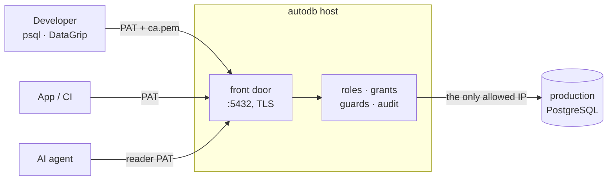

# Tutorial: put production behind autodb

By the end of this tutorial, nobody on your team holds the production database
password. Developers, applications and AI agents each connect with their own
personal access token (PAT), production accepts connections from one host
only, and every statement is audited under the name of whoever ran it.



It takes about half an hour. The scripts do the heavy lifting, and every one
of them can rehearse first with `--check`, which changes nothing.

## What you need

- **A small Linux VM** that can reach production: 1 vCPU and 1 GB of RAM is
  enough to start. The tested path is a Debian-family host (Ubuntu 24.04);
  other distributions are a best effort, so use a disposable VM for them.
- **A stable address** for it: a DNS name, or a static IP. Clients will verify
  the certificate against it.
- **SSH access** to the VM from your workstation, as root or a sudoer.
- **Firewall rules** letting your team reach the VM on port `5432`, and
  letting the VM reach production.

## 1. Rehearse

From your workstation, download the scripts and ask for the plan:

```sh
base=https://raw.githubusercontent.com/yongjohnlee80/autodb/main
curl -fsSL -O "$base/provision_vm.sh" -O "$base/install_frontdoor.sh"
sh provision_vm.sh --check --user root --host 203.0.113.10
```

`--check` connects, measures the VM, and prints what it would do and the
front-door size that host can honour. Nothing is changed. Read both scripts
while you are here: they will run as root on the VM.

## 2. Provision the host

```sh
sh provision_vm.sh --apply --user root --host 203.0.113.10 --dns autodb.example.com
```

Leave out `--dns` to issue the certificate for the IP address instead.

The TUI's server listens on a **loopback port** (7419) by default. That is what
lets each person on the host open the TUI and mint their own token (step 6),
and it is why the installer writes `/etc/autodb/client.toml`, which holds only
the server's address. It binds `127.0.0.1`, so it is not reachable off the
host. The trade is that every account on the host can reach the sign-in
prompt, and there is no login rate limiting there yet, so give host accounts
only to people you would give autodb accounts. `--rpc-socket` uses a unix
socket instead: the stronger boundary, but then only root and the service
account can open the TUI, and every token is minted by root.

The script prepares the machine (swap on small hosts, base packages, a Go
toolchain), builds the newest release, and hands off to the installer, which
interviews you. Pressing return accepts the computed default every time:

- **The meta store**, which is autodb's own database of users, grants,
  encrypted secrets and the audit log. `sqlite` is the light choice; pick
  PostgreSQL (`pg-local` or `pg-remote`) before there is production data,
  because moving from SQLite later is one-way.
- **The certificate** for your DNS name or IP, and the front-door port.
- **The first administrator**, and your master passphrase. This is the
  `autodb --init` step: it also enrols the unattended unlock, so the service
  survives a reboot without somebody typing the passphrase.

When it finishes, the closing notes print the exact commands for this host.
Keep them.

## 3. Export the CA certificate

Every client needs one file: the CA that signed the front door's certificate.

```sh
ssh root@203.0.113.10 /usr/local/bin/autodb --config /etc/autodb/config.toml --create-cert --export-ca > ca.pem
```

`--export-ca` only reads the existing CA; it writes nothing. `SPC k` in the
TUI shows the same certificate as text you can copy. It is public material;
share it with your team however you like.

## 4. Add production as a connection

Open the TUI on the host:

```sh
ssh -t root@203.0.113.10 autodb --ui --config /etc/autodb/client.toml
```

Sign in as the administrator, then:

1. `SPC c` → `a` (**Add**): name the connection, pick `postgres`, and paste the
   production DSN. It is encrypted when you save it and never shown again.
   **Use a database role created for autodb alone**, not a login your team
   already shares: step 7 retires the shared one, and a connection's DSN
   cannot be edited after it is saved.
2. `SPC c` → `e` (**Edit**) on that connection: set **proxy** to `yes`. That
   is what makes it reachable through the front door and lets people mint
   tokens for it. Set the **capability profile** to `session` as well: real
   clients such as DataGrip and most drivers send `BEGIN` and `SET`, which the
   default `v1compat` profile refuses.
3. `SPC c` → `t` (**Test**) to check that autodb can reach production.

## 5. Create accounts and grants

`SPC u` opens the users manager:

1. `a` (**Add**) a user for each person, application and agent. Give each the
   lowest role that works:

   | Role | Can run |
   |---|---|
   | `reader` | `SELECT`, inside a transaction PostgreSQL keeps read-only |
   | `editor` | reads and writes, through every guard |
   | `admin` | everything, including managing users and connections |

2. `c` (**Grant connection**) on each user, for the connection they need.
   A role alone reaches nothing: access is the role **and** a grant on that
   specific connection, for admins too.
3. `i` (**IPs**) to limit where each user may sign in from.

## 6. Hand out tokens

Each person mints their own token, so nobody else ever sees it. They do it in
the TUI on **their own computer**, connected to this server through Remote
Control: turn it on and register their SSH keys as
[Remote access](../remote-access.md) describes, and each of them runs

```sh
autodb --ui --remote <the server's profile id>
```

(An operator on the host can still open the TUI there, with the client config:
`ssh -t root@autodb.example.com autodb --ui --config /etc/autodb/client.toml`.)

Then `SPC T` → `c` (**Create**): a name (`work-laptop`), an expiry in days
(90 by default, 365 at most), optional IP ranges, and the connection. autodb
shows a **connection card** with a ready DSN and JDBC URL:

```
postgres://alice:<token>@autodb.example.com:5432/<database>?sslmode=verify-full&sslrootcert=ca.pem
```

The token is shown once, and the server keeps only its hash, so copy it before
closing the card. That DSN goes into `psql`, DataGrip, DBeaver or any
PostgreSQL driver.

**For an AI agent**, create a `reader` user for it (or `editor`, if it must
write), grant it one connection, and mint its token the same way. Keep the
token in your secret store, for example [`pass`](https://www.passwordstore.org/),
and give the agent the DSN through its PostgreSQL client or MCP server. The
agent can then do exactly what that account may do on that one connection,
every statement it runs is audited under its name, and revoking the token
(`SPC T` → `r`) cuts it off at once.

**For an application**, give it an `editor` account of its own, so its traffic
is audited separately from any person's.

## 7. Close production's door

Everything so far added a route. This step removes the others. In your
database's firewall, security group or authorised-networks list, allow **only
the autodb host's address**, and take everything else out. Then change the
password of every login your team used to share, or drop those logins, since
they have probably been copied into places you cannot audit. autodb is not
affected: it connects with its own role from step 4.

From now on the only way into production is through a door that knows who you
are.

## 8. Day two

**See who did what.** `SPC H` is the script history: every statement, the user
who ran it, the connection, the duration, the rows and the outcome. Refusals
are there too.

**Update** to the newest release, on the host. It swaps the binary, restarts
the service, and puts the previous binary back if the new one does not come up:

```sh
curl -fsSL -O https://raw.githubusercontent.com/yongjohnlee80/autodb/main/update_frontdoor.sh
sudo sh update_frontdoor.sh --check   # installed vs available; changes nothing
sudo sh update_frontdoor.sh
```

**Offboard someone.** Disable the user (`SPC u` → `t`), and every token they
hold stops working at once.

**Remove autodb**, on the host. The uninstaller archives the meta store first
and refuses to delete anything if the archive is not good:

```sh
curl -fsSL -O https://raw.githubusercontent.com/yongjohnlee80/autodb/main/uninstall.sh
sudo sh uninstall.sh --print-targets   # every path it would delete
sudo sh uninstall.sh --apply
```

## Where to go next

- The [operator reference](operations.md) explains sizing, the meta store
  options, TLS, the update rollback and the uninstaller's safety checks, and
  lists the things to be aware of on a small host.
- [`config.example.toml`](../../config.example.toml) documents every setting,
  including the transaction timeouts and the front door's limits.
- The [security model](../security.md) describes the gates every statement
  passes through.
